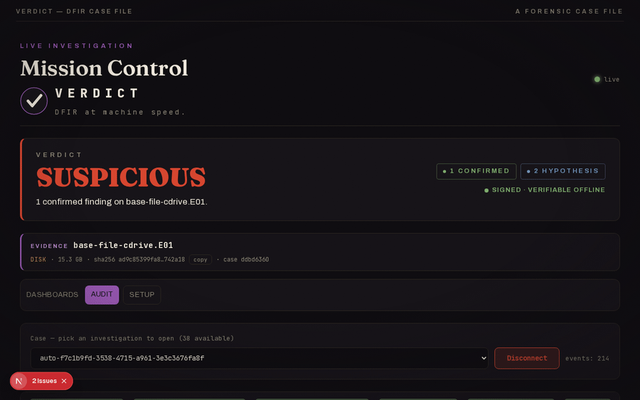
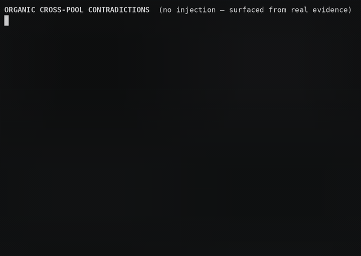
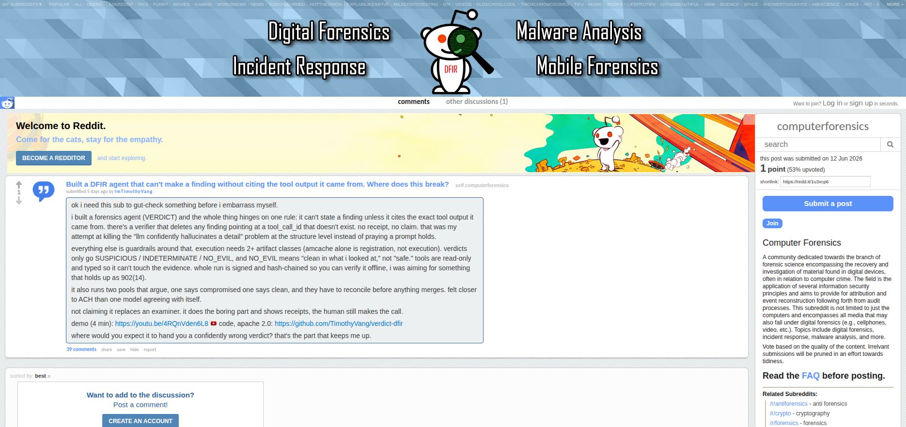
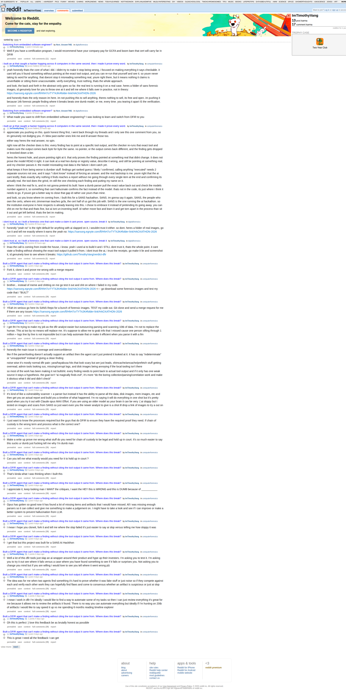

# VERDICT — Community & Contribution Hub

This is the **community front door** for **VERDICT**, a digital-forensics & incident-response (DFIR)
agent that runs inside [Claude Code](https://claude.com/claude-code). The code lives in the main
project repo — **this repo is where you find the open problems, file ideas, ask questions, and pick
something to work on.**

> VERDICT shipped at a SANS AI hackathon. It works, the core idea holds up — and it can be a lot
> better. I'd rather build it in the open with people who know DFIR and AI than grind it solo. If
> that's you: welcome, and thank you.

**Where things live**

| You want to… | Go here |
|---|---|
| Read the code / build it | the project repo (see *Project links* below) |
| Pick an open problem, file an idea, ask a question | **right here** — [open an issue](../../issues/new/choose) |
| Understand the design deeply | the project's `docs/` and published docs site (links below) |

> **Note on timing.** The public release repo is in a judging freeze, so code changes are landing on
> the **dev** repo (`TimothyVang/sans-hackathon`) and promote to release after judging closes. File
> issues and discussion here anytime; code PRs target the dev repo until the freeze lifts.

---

## What VERDICT is (the 90-second version)

There's no separate app server — the Claude Code session *is* the engine. You point VERDICT at
evidence (a memory image, Windows Event Logs, a disk image, a packet capture, or a whole multi-host
case folder) and it:

1. opens a read-only **Case** and SHA-256s the evidence,
2. drives a **narrow, typed, read-only** tool surface (43 product tools — 31 Rust DFIR tools + 12
   Python crypto/memory tools; **no `execute_shell`, ever**),
3. **verifies every Finding** (re-runs the cited tool and compares output hashes),
4. and writes a **scoped verdict** — `SUSPICIOUS` / `INDETERMINATE` / `NO_EVIL` — plus an analyst
   report, sealed into a **hash-chained, signed manifest you can verify offline**.

It is **not** an autonomous responder (the analyst approves the plan; the verifier re-runs every
cited tool before any Finding reaches the report), and `NO_EVIL` is never a whole-environment clean
bill — only "no reportable Finding in the artifacts actually examined." That scoping discipline is
the point.

---

## See it in action

Animated captures of VERDICT in action (silent — they loop inline). For the full narrated version
with sound: ▶ **[4:35 walkthrough on YouTube](https://youtu.be/4RQnVden6L8)**.

**An investigation, end to end** — `case_open` → the typed DFIR pipeline → verifier → a signed `SUSPICIOUS` verdict


**The live dashboard** — pipeline stages landing in real time


**Tamper-evident custody** — altering a sealed verdict fails `manifest_verify`


**Committed self-correction** — a confidence-tier flip recorded in the audit chain


**Scaled to a fleet** — the 22-host SRL-2018 enterprise case, host-by-host inside the SANS SIFT VM



**Contradiction surfacing** — the two analysis pools disagree; flagged before the judge merges



**One-command setup** — install + preflight doctor


> The longer **narrated** walkthroughs (feature deep-dives, educational explainer, contributor call)
> are multi-minute MP4s with audio — those don't embed inline on GitHub unless uploaded as a
> release/issue asset, so the [YouTube walkthrough](https://youtu.be/4RQnVden6L8) stands in for them.

<!-- Why GIFs, not <video>: GitHub strips <video> tags pointing at committed/raw repo URLs (its
     inline player only renders for upload-generated user-attachments URLs). To embed a real MP4 with
     sound: drag the file into a GitHub Issue or release-note editor, copy the resulting
     https://github.com/user-attachments/assets/<id> URL, and paste THAT on its own line (auto-renders
     a player) or as a <video src>. Markdown image of a GIF always renders. -->

---

## The hard problem we want help with: keeping the AI honest

The thing that is **not** fully solved is the one everybody worries about with an LLM doing
forensics: **hallucination.** A language model will, given the chance, confidently assert that a
binary ran or data was exfiltrated when the evidence doesn't support it.

VERDICT's bet is that you don't fix this with a better prompt — you fix it **architecturally**, so a
hallucination *can't survive into the verdict* unless it passes gates that re-check it against
re-runnable tool output and corroborating artifacts:

- **Citation or it didn't happen** — every Finding cites a `tool_call_id`; uncited claims are vetoed.
- **Verifier replay** — the verifier re-runs each cited tool and compares output hashes; drift
  downgrades or rejects the Finding. Replay is deterministic, so the audit chain attests exactly what
  the model saw.
- **Two biased pools + contradiction surfacing** — a persistence-biased and an exfil-biased pool work
  the same evidence; disagreements are flagged *before* the judge merges.
- **The ≥2-artifact-class rule** — any "this ran" / "this was exfiltrated" claim needs two distinct
  evidence classes or it's downgraded to `HYPOTHESIS`. Hayabusa/Sigma/YARA/malfind are leads, not
  facts.
- **A confidence taxonomy + coverage manifest + signed custody** make the limits explicit instead of
  papering over them.

**It works — but it doesn't drive the false-positive rate to zero, and the gates have gaps.** That's
where contributors come in.

---

## From the community

i posted this to r/computerforensics and r/digitalforensics and straight up asked people to break it.
they came at it hard — which is exactly what i wanted. here are the real concerns and my honest
answer to each. no spin. read the threads yourself, links at the bottom.

### "ai slop, i wouldnt trust an ai for forensics"

yeah no — thats the right default for anything with ai slapped on it, and honestly i wouldnt trust it
either. so dont. i used ai to build this and i STILL dont trust it, thats the whole point. it cant
state a finding without pointing at the exact tool output it pulled it from, and you can re-run that
tool yourself and check. i dont trust the ai, i trust the receipts.


and the custody is tamper-evident — edit a sealed verdict and `manifest_verify` fails:


### "itll still hallucinate / misread the raw output" — u/ProofLegitimate9990

this was the sharpest one and theyre right, so im not gonna dodge it. straight up: the verifier that
**ships** checks that a finding CITES a tool output — not that the claim actually matches whats in it.
so the model can still misread something real. **i did NOT solve that.**

what i built to pull it down: two pools work the same evidence and have to agree, a single-source
claim gets downgraded, execution needs 2+ artifact classes, and when a confidence tier flips it gets
committed to the audit chain so you can watch it happen. that lowers it. it doesnt kill it.


whats actually in progress (on a branch, **NOT** in the build youd run): a deterministic fidelity
check that makes a finding declare the exact values it claims and rejects it if those values arent in
the cited output. that kills the "claimed a value thats not even there" class of misread. it does NOT
touch interpretation — "these two artifacts mean lateral movement" stays a hypothesis a human signs
off on. preview, not shipped, not on by default. im not gonna tell you i solved hallucination,
because i didnt.

### "this is gonna replace analysts / wheres the accountability" — u/Drevicar

nah, and honestly i agree with you. its a triage tool. it parses the 10tb so you review faster — it
doesnt make the call and it doesnt take the accountability, you do. the analyst approves the plan and
the verifier re-runs every cited tool before anything hits the report.

### go run it yourself

dont take my word for any of this. clone it, point it at real images, and tell me exactly where it
breaks — id genuinely love to see it:

```bash
git clone https://github.com/TimothyVang/verdict-dfir.git
cd verdict-dfir
bash scripts/setup
# grab a case from the SANS hackathon image set:
#   https://sansorg.egnyte.com/fl/HhH7crTYT4JK#folder-link/HACKATHON-2026
scripts/verdict <downloaded-image>
```

go make it lie and screenshot it. if you find where it breaks, [open an issue](../../issues/new/choose)
— i WANT the critiques.

**the threads:** [r/computerforensics — "where does this break?"](https://www.reddit.com/r/computerforensics/comments/1u3xcp6/) · [r/digitalforensics — "cant make a claim it cant prove"](https://www.reddit.com/r/digitalforensics/comments/1u76jjl/) · [r/computerforensics — "made it prove every word"](https://www.reddit.com/r/computerforensics/comments/1u76442/)

<details>
<summary>screenshots — the thread + my replies</summary>

the post asking people to break it:



my replies across the threads:



</details>

---

## Where you can help (open problems)

These are where help is most useful right now — each one is grounded in the project's own limitation
docs (`false-positives.md`, `architecture.md`), not a wishlist. Want to tackle something else, or
think a priority is off? Open an issue and say so.

| Area | What's open | Skills | Difficulty |
|---|---|---|---|
| **FP floor / calibration** | Not zero-FP against the clean benign baseline. Auto-detect the rule that fired, propose a tune-out, track the FP floor over time. | DFIR, Sigma/YARA tuning, Python | medium |
| **DKOM vs. acquisition smear** | `vol_pslist`/`vol_psscan` divergence looks like a rootkit but is often a corrupt/smeared capture. Disambiguating it reliably is hard. | memory forensics, Volatility 3 | hard |
| **Prompt-injection at the evidence boundary** | Attacker-controlled evidence text is neutralized at the MCP output boundary. New evasion classes / a fuzz corpus would harden it. | security, Rust/Python | medium |
| **Coverage breadth** | More evidence types and parsers (macOS/Linux artifacts, more cloud sources) behind the typed tool surface — never `execute_shell`. | DFIR tooling, Rust | medium |
| **Evaluation corpus** | A bigger public set of golden cases + a metric for "did the agent over-claim?" so improvements are measurable. | DFIR, eval/benchmarking | research |
| **Cross-host FP filters** | Filter more enterprise EDR/agent stacks so they don't read as lateral movement. | IR at scale, Python | good-first |
| **Docs & onboarding** | Make a first run frictionless for a newcomer. | technical writing | good-first |

[**→ Pick one and open an issue**](../../issues/new/choose)

---

## How to contribute

1. **Open an issue here first** for anything non-trivial (templates: *Pick an open problem*,
   *Question / discussion*) so we agree on the approach before you spend a weekend on it.
2. **Build/test/submit mechanics** (CI tiers, conventional commits, the live-run "done" gate) live in
   the project's `CONTRIBUTING.md` — see *Project links*.
3. **Invariants a PR must not break** (so your work isn't wasted): no `execute_shell` tool; every
   Finding cites a `tool_call_id`; evidence is read-only; Claude Code is the orchestrator;
   AGPL/GPL DFIR tools stay subprocess-only. Full list in the project's `CONTRIBUTING.md` / `CLAUDE.md`.

See also: [CONTRIBUTING.md](CONTRIBUTING.md) (how to engage *here*) and
[CODE_OF_CONDUCT.md](CODE_OF_CONDUCT.md).

---

## Project links

- **Dev repo (active during the freeze):** https://github.com/TimothyVang/sans-hackathon
- **Release repo (canonical, post-judging):** https://github.com/TimothyVang/verdict-dfir
- **Published docs:** https://timothyvang.github.io/verdict-dfir/
- Design deep-dives in the project's `docs/`: `architecture.md`, `false-positives.md`,
  `verdict-semantics.md`, and the runtime rules under `agent-config/`.

---

Licensed under [Apache-2.0](LICENSE). Tapped out, shipping anyway, and glad you're here.
